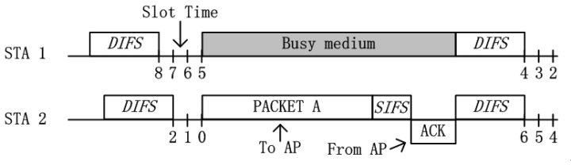
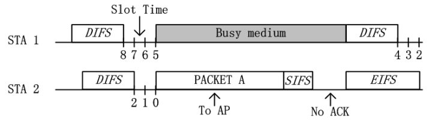
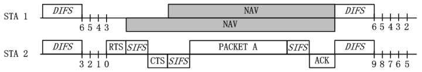

[802.11协议精度2](https://zhuanlan.zhihu.com/p/20721272)

## Basic模式
1. STA随机选择一个等待时隙数，开始倒计时
2. STA在等待时监听信道，如果信道忙就暂停计时
3. 如果信道一直空闲，STA开始传输数据，传输完后等待AP反馈ACK
4. 如果收到ACK，表明传输成功，开始下一轮传输

5. 如果没有收到ACK，延长等待时间，进行BEB，开始下一轮传输

## BEB机制
1. 如果两个STA碰巧同时开始传输数据，AP不会反馈ACK
2. STA要从一个更大的范围内随机选择一个等待时隙数，开始倒计时

## RTS/CTS模式

有可能STA无法收到另一个STA发射的信号，误以为信道空闲。为此引入RTS/CTS模式，实现虚拟载波侦听。

1. STA倒数至0后，首先发送RTS给AP
2. 如果无冲突，AP广播CTS给STA
3. STA收到属于自己的CTS后，开始传输数据
4. STA收到不属于自己的CTS后，暂停计时

RTS/CTS另外一个思维就是 "**采用小的数据包碰撞，来避免大的数据包碰撞**" ，从而如果数据包太小，那么则不需要采用RTS/CTS机制。设置RTS_threshold的范围一般为2347，其单位是byte，即如果数据包大小如果大于2347 byte，那么才会采用RTS/CTS模式

## 物理载波监听
1. 物理载波侦听和虚拟载波侦听同时采用
2. 物理载波侦听包括能量检测和载波检测
    1. 能量检测（Energy Detection）：是直接用物理层接收的能量来判断是否有信号进行接入，若信号强度大于ED_threshold，则认为信道是忙，若小于ED_threshold，则认为信道是闲。同时该ED_threshold的设置与发送功率有关，比如发送功率大于100mW，那么ED_threhold约为-80dBm，发送功率在50mW至100mW之间，那么ED_threshold应该为-76dBm。不过至于具体的数值，需要查看其具体所对应版本的802.11协议。
    2. 载波侦听（Carrier Sense）：载波监听的方法指的是用来识别802.11数据帧的物理层头部（PLCP header）中的preamble部分。简单的说，802.11中的preamble部分采用特定的序列所构造，该序列对于发送方和接收方都是已知的，其用来做帧同步以及符号同步。在实际监听过程中，节点会不断采样信道信号，用其做自相关或者互相关运算，其中自相关在基于OFDM的802.11技术中常用，比如802.11a，而互相关在基于DSSS技术中常用，比如802.11b。与能量检测类似，相关计算值需要与一个阈值进行判断，若大于，则认为检测到了一个信号，若小于则没有检测到。